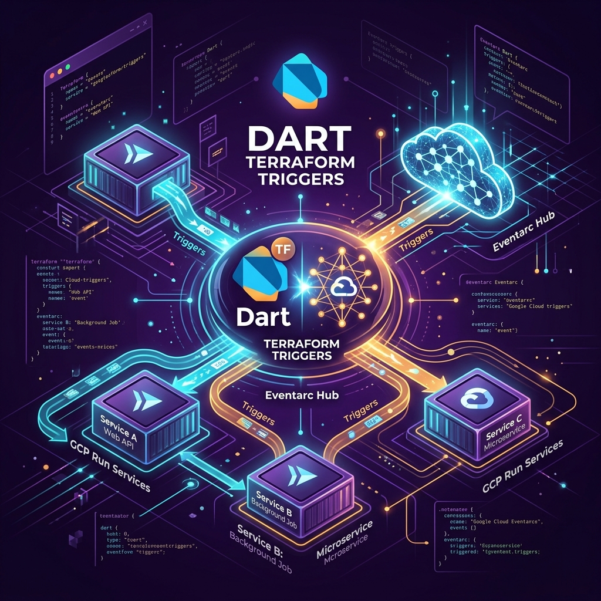

# Dart Terraform Triggers (`dtt`)



[](https://github.com/kevmoo/dtt/actions/workflows/ci.yml)
[](LICENSE)
[](#)
[](#)

A high-performance, developer-centric toolchain and library designed to make it effortless for Dart developers to deploy serverless (Google) Cloud Run services that respond to Eventarc triggers. 

`dtt` bridges the gap between infrastructure configuration and type-safe application code. It automatically resolves GCP event payload schemas, executes remote protobuf generation, mounts Shelf-based HTTP server routers, and synthesizes production-ready Terraform resources.

---

## 📦 Package Ecosystem

| Package | Version | Description |
| :--- | :--- | :--- |
| [**`dtt`**](packages/dtt) | [](https://pub.dev/packages/dtt) | Developer CLI tool (`dart pub global activate dtt`) for scaffolding, building, and deploying. |
| [**`dtt_runtime`**](packages/dtt_runtime) | [](https://pub.dev/packages/dtt_runtime) | Shelf event routing engine, `DttEventRouter`, and `EventSimulator` test harness. |
| [**`google_cloud_events`**](packages/google_cloud_events) | [](https://pub.dev/packages/google_cloud_events) | Pre-compiled Protobuf payload data classes for GCP & Firebase Eventarc triggers. |
| [**`firebase_auth_example`**](examples/firebase_auth_example) | Example | Runnable end-to-end sample microservice. |

---

## 📖 Navigating the Project

Explore the canonical specifications and operational walkthroughs below:

* **[CLI Reference Manual](packages/dtt/README.md)**: Full `dtt` command & flag reference matrix and `dtt.yaml` manifest schema specifications.
* **[Runtime API Guide](packages/dtt_runtime/README.md)**: Programmatic Shelf router registration, CloudEvent handlers, and unit testing using `EventSimulator`.
* **[Technical Architecture](docs/architecture.md)**: Deep dive into data flows, OIDC authentication, schema resolvers, and custom routing engines.
* **[Security Threat Model](docs/threat_model.md)**: High-fidelity security mapping detailing trust boundaries, privileged operations, and lockdowns.
* **[Production Deployment Guide](docs/deployment_guide.md)**: Operational guide covering Cloud Run perimeter security, IAM invokers, and verification.
* **[Maintainer Toolchain Guide](tool/README.md)**: Execution sequence and architecture for our two-stage offline catalog codegen scripts.

---

## ⚡ The Developer Experience: End-to-End

With `dtt`, configuring, coding, testing, and deploying an event-driven serverless system is compressed into clean terminal commands:

### 1. Initialize your Project Workspace
```bash
dtt init --project-id=my-gcp-project --service-name=gcs-uploader
```
Scaffolds a standard Dart microservice and establishes the root `dtt.yaml` configuration manifest.

### 2. Register an Eventarc Trigger
```bash
dtt trigger add --type=google.cloud.storage.object.v1.finalized --handler=onNewUpload
```
Downloads Protobuf models, compiles type-safe Dart classes under `lib/src/generated/`, and scaffolds a strongly-typed handler.

### 3. Implement Type-Safe Business Logic
```dart
// lib/src/handlers/on_new_upload.dart
import 'package:google_cloud_events/google_cloud_events.dart';
import 'package:dtt_runtime/dtt_runtime.dart';

void onNewUpload(CloudEvent<StorageObjectData> event) {
  final StorageObjectData metadata = event.data;
  print('Processing file upload ID: ${event.id} in bucket: ${metadata.bucket}');
}
```

### 4. Local Event Simulation (Offline Development)
```bash
dtt dev --emit-event=google.cloud.storage.object.v1.finalized \
        --payload='{"bucket":"test-bucket","name":"sample.txt"}'
```
Boots a local development server and simulates CloudEvent triggers offline.

### 5. Build & Deploy Infrastructure
```bash
dtt build --tag=v1.0.0
dtt deploy
```
Compiles Dart AOT container images, pushes to Google Artifact Registry, and provisions zero-trust Cloud Run & Eventarc infrastructure via Terraform.

> 👉 **For the complete `dtt.yaml` manifest schema and CLI flag matrix, see [packages/dtt Documentation](packages/dtt/README.md).**

---

### 6. Live Cloud Verification
Once deployed, verify your event routing pipeline immediately using two simple terminal commands:

#### Trigger the Event (Trivial GCS write)
Pipe any test snippet directly into your Terraform-provisioned bucket:
```bash
echo "Hello live Cloud Run trigger!" | gcloud storage cp - gs://my-bucket/ping.txt
```
*(Finalizing the upload fires `google.cloud.storage.object.v1.finalized` via
Eventarc).*

#### Verify Handler Execution (Cloud Logging)
Read your container's stdout structured log stream in real-time:
```bash
gcloud beta run services logs read gcs-uploader --limit=5
```
You will immediately see your developer callback logging the deserialized event!

---

## 🛠️ System Prerequisites

To run `dtt` on your local workstation, ensure you have installed:
- **Dart SDK**: Version `3.12.0` or higher.
- **Protocol Buffers Compiler (`protoc`)**: Version `3.0` or higher, equipped with the Dart `protoc_plugin` package executable in your system path.
- **Terraform CLI**: Version `1.5` or higher.
- **Google Cloud SDK (`gcloud` CLI)**: Authorized to access target resource management APIs.
- **Docker Daemon**: Active for processing container packaging (optional if delegating directly to GCP Cloud Build).

---

## 🌟 Premium Architecture Highlights

- **Binary & Structured Event Processing**: Seamless support for both Eventarc envelope bindings, parsing either HTTP request headers (Binary Mode) or body parameters (Structured Mode).
- **Zero-Trust Terraform Generation**: Generated Terraform templates follow the strictest GCP guidelines:
  - Default ingress set to `INGRESS_TRAFFIC_INTERNAL_ONLY` to block unauthorized public network scans.
  - Dedicated custom Service Accounts generated for each Eventarc trigger agent.
  - Full OIDC-authenticated pushes ensuring cryptographic request signature validations before event triggers ever enter our handler codes.
- **Statically Compiled Containers**: The containerization pipeline runs custom multi-stage AOT builds, reducing final image footprints and speeding up Cold Starts on Cloud Run down to a fraction of a second.
