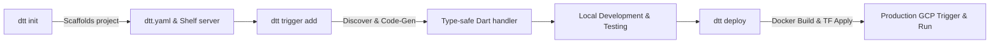
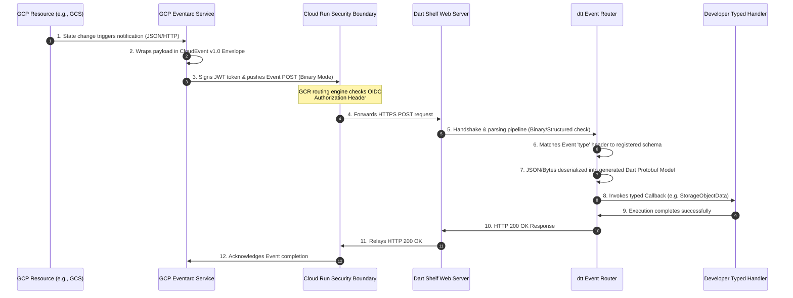

# Dart Terraform Triggers: Technical Architecture & System Design


This document provides a high-fidelity system design and architectural specification for `dart_terraform_triggers` (CLI tool codenamed `dtt`). This library and CLI orchestrate the serverless lifecycle for Dart developers deploying to Google Cloud Run, automatically configuring Google Eventarc triggers via Terraform, and compiling type-safe Event payload models.

---

## 1. Project Vision & Core Strategy

Modern event-driven development on Google Cloud Platform (GCP) requires combining multiple layers: serverless computing (Cloud Run), event-routing networks (Eventarc), resource provisioning engines (Terraform), and type-safe backend environments (Dart). Currently, Dart developers must manually orchestrate these configurations, resolve Eventarc JSON/Protobuf specifications, write Shelf webhook routers, and design infrastructure templates.

`dtt` bridges this gap, exposing a unified command-line and package interface:
1. **Low-friction Setup**: Simple configuration using a root-level [dtt.yaml](../dtt.yaml) file.
2. **Schema Discovery**: Automatic resolution and code-generation of official GCP event schemas directly from the `google-cloudevents` repository.
3. **Type-Safe Routing**: Seamless deserialization of incoming CloudEvents into strongly-typed Dart protobuf models.
4. **Declarative Infrastructure**: Dynamic code-generation of standard, production-grade Terraform resources, ensuring secure, repeatable deployments.

---

## 2. Target Developer Workflow

The CLI maps onto the developer's typical day-to-day workflow, executing actions across three primary phases:



### Phase 1: Initialization (`dtt init`)
Creates the initial directory structure, setting up standard microservice files:
- [pubspec.yaml](../pubspec.yaml) initialized with required dependencies (`shelf`, `googleapis`, `protobuf`, `args`).
- [dtt.yaml](../dtt.yaml) template for project metadata and trigger registrations.
- [bin/server.dart](../bin/server.dart) standard Shelf HTTP server equipped with the Eventarc routing middleware.

### Phase 2: Adding Triggers (`dtt trigger add`)
An interactive or declarative command that updates [dtt.yaml](../dtt.yaml):
1. User specifies the target GCP event provider and event type (e.g., Storage bucket uploads).
2. The engine fetches the corresponding proto file from `github.com/googleapis/google-cloudevents`.
3. Compiles the `.proto` using `protoc` and the Dart `protoc_plugin`.
4. Stubs a strongly-typed handler function in [lib/src/handlers/](../lib/src/handlers) and registers it in the central router.

### Phase 3: Safe Deployment (`dtt deploy`)
Automates containerization and serverless infrastructure deployment:
1. Generates Terraform configuration (`main.tf`, `variables.tf`, `outputs.tf`) containing necessary Google provider blocks.
2. Triggers a secure Docker image build (via Google Cloud Build or a local environment).
3. Invokes `terraform init` and `terraform apply` to provision:
   - The **Cloud Run service** running the Dart container.
   - The **Eventarc trigger** connected to the selected event source.
   - All **IAM Service Account bindings** required for OIDC-authenticated push triggers.

---

## 3. High-Fidelity Data Flow

Once deployed to production, event delivery relies on standard CloudEvents OIDC authentication. The sequence diagram below maps the runtime lifecycle of an event from an external change to its type-safe execution inside the Dart container.



---

## 4. CLI Architecture & Commands

The command-line interface is driven by `package:args` and is structured using the Command design pattern. The central runner is defined in [lib/src/cli/runner.dart](../lib/src/cli/runner.dart).

### Directory & Command Classes Map
- **CLI Runner**: [lib/src/cli/runner.dart](../lib/src/cli/runner.dart)
- **Init Command**: [lib/src/cli/commands/init.dart](../lib/src/cli/commands/init.dart)
- **Trigger List Command**: [lib/src/cli/commands/trigger_list.dart](../lib/src/cli/commands/trigger_list.dart)
- **Trigger Add Command**: [lib/src/cli/commands/trigger_add.dart](../lib/src/cli/commands/trigger_add.dart)
- **Generate Command**: [lib/src/cli/commands/generate.dart](../lib/src/cli/commands/generate.dart)
- **Deploy Command**: [lib/src/cli/commands/deploy.dart](../lib/src/cli/commands/deploy.dart)

### Configuration Schema (`dtt.yaml`)
A simple declarative configuration defines the local metadata and active Eventarc mapping:

```yaml
# dtt.yaml
project:
  id: my-gcp-project-123
  region: us-central1
  service_name: dart-storage-processor

triggers:
  - name: on-upload
    type: google.cloud.storage.object.v1.finalized
    provider: storage.googleapis.com
    path: /events/uploads
    resource: projects/_/buckets/my-user-uploads-bucket
    handler: onStorageUpload
```

---

## 5. Schema Resolution & Dart Code Generation

To provide type-safety, the code generator implements an automated pipeline resolving raw schema assets:

1. **GCP Event Database**: Contains standard catalog definitions mapping typical Eventarc event types to official Protobuf source file paths:
   - `google.cloud.storage.object.v1.finalized` $\rightarrow$ `google/events/cloud/storage/v1/data.proto`
   - `google.cloud.firestore.document.v1.written` $\rightarrow$ `google/events/cloud/firestore/v1/data.proto`
   - `google.cloud.pubsub.topic.v1.messagePublished` $\rightarrow$ `google/events/cloud/pubsub/v1/data.proto`
2. **Dynamic Downloader**: Uses `package:http` to pull selected proto files and their transitive dependencies (e.g. `google/protobuf/timestamp.proto`, `google/events/cloudevents.proto`) from `googleapis/google-cloudevents` repository.
3. **Protoc Execution**: Triggers the system's protobuf compiler:
   ```bash
   protoc --dart_out=lib/src/generated \
     -I lib/src/schemas \
     lib/src/schemas/google/events/cloud/storage/v1/data.proto
   ```
   This generates standard Dart bindings (`data.pb.dart`, `data.pbenum.dart`, etc.) including helper model descriptors equipped with binary and JSON deserialization methods.

---

## 6. Type-Safe CloudEvent Router

A custom routing framework is layered on top of Dart's standard server infrastructure:

```dart
// lib/src/cloudevents.dart
import 'dart:convert';
import 'package:shelf/shelf.dart';

class CloudEvent<T> {
  final String id;
  final Uri source;
  final String specVersion;
  final String type;
  final String? dataContentType;
  final T data;

  CloudEvent({
    required this.id,
    required this.source,
    required this.specVersion,
    required this.type,
    required this.dataContentType,
    required this.data,
  });

  factory CloudEvent.parse(Request request, T Function(Object?) dataParser) {
    // 1. Resolve delivery mode (Binary vs Structured)
    final contentType = request.headers['content-type'] ?? '';
    
    if (contentType.contains('application/cloudevents+json')) {
      // Structured Mode (envelope inside body)
      final bodyStr = request.readAsString(); // or async map
      final Map<String, dynamic> envelope = jsonDecode(bodyStr);
      return CloudEvent(
        id: envelope['id'] as String,
        source: Uri.parse(envelope['source'] as String),
        specVersion: envelope['specversion'] as String,
        type: envelope['type'] as String,
        dataContentType: envelope['datacontenttype'] as String?,
        data: dataParser(envelope['data']),
      );
    } else {
      // Binary Mode (envelope metadata in HTTP headers, payload in body)
      final id = request.headers['ce-id'] ?? '';
      final source = request.headers['ce-source'] ?? '';
      final specVersion = request.headers['ce-specversion'] ?? '';
      final type = request.headers['ce-type'] ?? '';
      final ceContentType = request.headers['ce-datacontenttype'];
      
      // Raw data is stored in the HTTP post body
      final rawBody = request.read(); // Stream<List<int>> or mapped
      // Parse payload using delegate
      final parsedData = dataParser(rawBody);

      return CloudEvent(
        id: id,
        source: Uri.parse(source),
        specVersion: specVersion,
        type: type,
        dataContentType: ceContentType,
        data: parsedData,
      );
    }
  }
}
```

The CLI automatically stubs out corresponding typed handlers inside the user's project, keeping standard boilerplates isolated:

```dart
// lib/src/handlers/storage_upload_handler.dart
import 'package:functions_framework/functions_framework.dart';
import 'package:google_cloudevents/storage_object_data.pb.dart';
import '../../cloudevents.dart';

/// Type-safe callback handling file finalizations in Google Cloud Storage
void onStorageUpload(CloudEvent<StorageObjectData> event) {
  final StorageObjectData fileMetadata = event.data;
  print('Successfully processed file: ${fileMetadata.name}');
  print('Bucket path: gs://${fileMetadata.bucket}/${fileMetadata.name}');
  print('Content Type: ${fileMetadata.contentType}');
  print('Storage class: ${fileMetadata.storageClass}');
}
```

---

## 7. Automated Infrastructure Generation (Terraform)

Rather than writing infrastructure files manually, the generator reads [dtt.yaml](../dtt.yaml) and outputs declarative resources in `terraform/`:

- **Main Config**: [terraform/main.tf](../terraform/main.tf)
- **Variable Defs**: [terraform/variables.tf](../terraform/variables.tf)
- **Output Metrics**: [terraform/outputs.tf](../terraform/outputs.tf)

Below is an illustration of the generated declarative resource blocks inside `terraform/main.tf` mapping our target service, secure IAM service agents, and triggers:

```hcl
# terraform/main.tf

terraform {
  required_providers {
    google = {
      source  = "hashicorp/google"
      version = "~> 5.0"
    }
  }
}

provider "google" {
  project = var.project_id
  region  = var.region
}

# 1. Dedicated Service Account for the Eventarc Trigger
resource "google_service_account" "eventarc_invoker" {
  account_id   = "${var.service_name}-trigger-sa"
  display_name = "Eventarc Trigger Service Account invoking ${var.service_name}"
}

# 2. Grant the service account permissions to invoke Cloud Run
resource "google_cloud_run_service_iam_member" "invoker_binding" {
  location = google_cloud_run_v2_service.dart_service.location
  name     = google_cloud_run_v2_service.dart_service.name
  role     = "roles/run.invoker"
  member   = "serviceAccount:${google_service_account.eventarc_invoker.email}"
}

# 3. Create the Serverless Cloud Run Service running the Dart Container
resource "google_cloud_run_v2_service" "dart_service" {
  name     = var.service_name
  location = var.region
  ingress  = "INGRESS_TRAFFIC_INTERNAL_ONLY" # Highly secure restriction!

  template {
    containers {
      image = var.container_image
      ports {
        container_port = 8080
      }
      resources {
        limits = {
          cpu    = "1"
          memory = "512Mi"
        }
      }
    }
  }
}

# 4. Configure the Google Eventarc Trigger matching GCS Bucket finalizations
resource "google_eventarc_trigger" "gcs_trigger" {
  name     = "gcs-upload-trigger"
  location = var.region

  matching_criteria {
    attribute = "type"
    value     = "google.cloud.storage.object.v1.finalized"
  }

  # Filter metadata targeting a specific bucket resource
  matching_criteria {
    attribute = "resource"
    value     = var.bucket_resource_id
  }

  destination {
    cloud_run {
      service = google_cloud_run_v2_service.dart_service.name
      region  = google_cloud_run_v2_service.dart_service.location
      path    = "/events/uploads"
    }
  }

  service_account = google_service_account.eventarc_invoker.email

  depends_on = [
    google_cloud_run_service_iam_member.invoker_binding
  ]
}
```

This structured generation guarantees correct, standardized settings—such as closing container entry boundaries using `INGRESS_TRAFFIC_INTERNAL_ONLY` and provisioning minimum-privilege OIDC Invoker roles.
