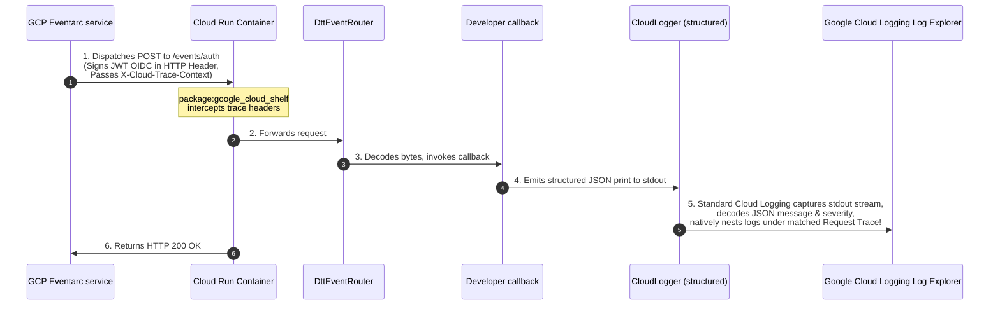

# GCP Production Deployment Guide: Firebase Auth Eventarc Triggers

This walkthrough outlines the complete, systems-grade deployment pipeline to build, push, and declare infrastructure resources for the [examples/firebase_auth_example](file:///Users/kevmoo/github/kevmoo/dart_terraform_triggers/examples/firebase_auth_example) microservice under your target Google Cloud Platform (GCP) project: **`n26-full-stack-dart`**.

---

## 🌌 1. Systems Observability Architecture

By pairing **`package:google_cloud_shelf`** (runtime serving) with **`package:google_cloud_logging`** (handler structured logs), we gain deep, automated, request-nested trace correlation out-of-the-box. 



---

## 📦 2. Production Monorepo Containerizer (`Dockerfile`)

Because standard AOT compilation requires resolving transitive workspace member configurations (linking `dtt_runtime` and `google_cloud_events`), the Dockerfile uses a **multi-stage build context anchored at the workspace root**.

Create this file at your monorepo workspace root: **`Dockerfile`**

```dockerfile
# Stage 1: Native AOT compilation environment
FROM dart:stable AS build

WORKDIR /app

# 1. Copy the complete monorepo dependency mappings
COPY pubspec.yaml pubspec.lock analysis_options.yaml ./
COPY packages/packages/ packages/
COPY examples/firebase_auth_example/ examples/firebase_auth_example/

# 2. Re-resolve and download cached workspace packages
RUN dart pub get

# 3. Compile the target examples app server to a standalone native binary
RUN dart compile exe examples/firebase_auth_example/bin/server.dart \
    -o examples/firebase_auth_example/bin/server

# Stage 2: Minimal, secure scratch runtime
FROM gcr.io/distroless/cc-debian12 AS runtime

WORKDIR /app

# Copy the compiled standalone executable from compilation stage
COPY --from=build /app/examples/firebase_auth_example/bin/server /app/server

# Expose serverless socket container port mapping
EXPOSE 8080

# Run the native server natively
ENTRYPOINT ["/app/server"]
```

---

## ☁️ 3. Google Cloud Build Pipeline

To build and compile your container natively on high-speed Arm64/x64 GCP hardware (with exactly 0 local Docker engines running on your workstation!), invoke Google Cloud Builds.

### A. Initialize the Artifact Registry Repository
Create a secure, regional Artifact Registry target repository under your project:
```bash
gcloud artifacts repositories create cloud-run-images \
    --repository-format=docker \
    --location=us-central1 \
    --description="Docker container repository for serverless Dart binaries" \
    --project=n26-full-stack-dart
```

### B. Submit the Native Cloud Build Compile Task
Execute this command at your **workspace root** to compile and push the distroless image directly inside GCP:
```bash
gcloud builds submit --tag \
    us-central1-docker.pkg.dev/n26-full-stack-dart/cloud-run-images/firebase-auth-triggers:latest \
    --project=n26-full-stack-dart
```

---

## 🛠️ 4. Declarative Infrastructure Blueprint (Terraform)

Create a dedicated directory at your workspace root named **`terraform/`** and map out the complete, zero-trust infrastructure assets:

### A. Main Infrastructure Manifest: `terraform/main.tf`
```hcl
terraform {
  required_version = ">= 1.3.0"
  required_providers {
    google = {
      source  = "hashicorp/google"
      version = ">= 5.0.0"
    }
  }
}

provider "google" {
  project = var.project_id
  region  = var.region
}

# 1. Google Cloud Run v2 Service Running our serverless Dart binary
resource "google_cloud_run_v2_service" "auth_service" {
  name     = "firebase-auth-service"
  location = var.region
  ingress  = "INGRESS_TRAFFIC_INTERNAL_ONLY" # Security boundary (prevents public internet HTTP spoofing!)

  template {
    containers {
      image = "us-central1-docker.pkg.dev/${var.project_id}/cloud-run-images/firebase-auth-triggers:latest"
      
      ports {
        container_port = 8080
      }

      resources {
        limits = {
          cpu    = "1"
          memory = "512Mi" # Lightweight footprints
        }
      }
    }
  }
}

# 2. Zero-Trust minimum privilege service account mapping
resource "google_service_account" "eventarc_invoker" {
  account_id   = "eventarc-auth-invoker"
  display_name = "Eventarc Firebase Auth Invoker"
}

# 3. Grant Invoker Service Account authorization to call our Cloud Run container
resource "google_cloud_run_v2_service_iam_member" "invoker_role" {
  name     = google_cloud_run_v2_service.auth_service.name
  location = google_cloud_run_v2_service.auth_service.location
  role     = "roles/run.invoker"
  member   = "serviceAccount:${google_service_account.eventarc_invoker.email}"
}

# 4. Bind Eventarc Receiver permissions to standard GCP service agent profiles
# (This allows GCP internal engines to dispatch signals to Eventarc queues)
resource "google_project_iam_member" "eventarc_receiver" {
  project = var.project_id
  role    = "roles/eventarc.eventReceiver"
  member  = "serviceAccount:${google_service_account.eventarc_invoker.email}"
}

# 5. GCP Eventarc Trigger Mapping user Created signals
resource "google_eventarc_trigger" "auth_created_trigger" {
  name     = "firebase-auth-created-trigger"
  location = var.region

  destination {
    cloud_run_service {
      service = google_cloud_run_v2_service.auth_service.name
      region  = var.region
      path    = "/events/auth" # Target webhook endpoint path route!
    }
  }

  matching_criteria {
    attribute = "type"
    value     = "google.firebase.auth.user.v1.created" # Target vertical event!
  }

  service_account = google_service_account.eventarc_invoker.email
}
```

### B. Mapped Variables: `terraform/variables.tf`
```hcl
variable "project_id" {
  type        = string
  description = "Target Google Cloud Platform Project ID."
  default     = "n26-full-stack-dart"
}

variable "region" {
  type        = string
  description = "Target GCP region for resources deployment."
  default     = "us-central1"
}
```

### C. System Outputs: `terraform/outputs.tf`
```hcl
output "service_url" {
  value       = google_cloud_run_v2_service.auth_service.uri
  description = "Prism URL of our deployed serverless Dart Cloud Run service container."
}

output "eventarc_trigger_id" {
  value       = google_eventarc_trigger.auth_created_trigger.id
  description = "Unique resource identifier tracking the active Eventarc trigger."
}
```

---

## 🚀 5. Deployment Checklist & Command Steps

Once variables and blueprints are mapped, execute these sequential command sweeps on your terminal to orchestrate live production assets:

### Step 1: GCP CLI Configuration Validation
Ensure your CLI session is authorized and pinned to your project context:
```bash
gcloud auth login
gcloud config set project n26-full-stack-dart
```

### Step 2: Build the Production Container Containerizer
Submit the monorepo build context straight to Google Cloud Build:
```bash
gcloud builds submit --tag \
    us-central1-docker.pkg.dev/n26-full-stack-dart/cloud-run-images/firebase-auth-triggers:latest \
    --project=n26-full-stack-dart
```

### Step 3: Terraform Orchestration & Resource Provisioning
Navigate to your `terraform/` folder and provision live systems:
```bash
cd terraform
terraform init
terraform plan
terraform apply -auto-approve
```

---

## 🔬 6. Live Observation Validation Check

Once provisioning apply completes:
1. Navigate to the **Firebase Console** under your app project `n26-full-stack-dart`.
2. Create a new test user account inside **Firebase Authentication** (or invoke your client app login flow!).
3. Open the **GCP Cloud Logging Log Explorer** inside `n26-full-stack-dart`.
4. Run the query targeting your serverless container service logs:
   ```query
   resource.type="cloud_run_revision"
   resource.labels.service_name="firebase-auth-service"
   ```
5. You will see a beautiful, trace-correlated, **structured JSON log entry** nesting user creations metadata natively:
   ```json
   {
     "message": "Firebase Auth user account created successfully for UID: test-uid-123",
     "severity": "INFO",
     "logging.googleapis.com/trace": "projects/n26-full-stack-dart/traces/trace-correlation-id",
     "payload": {
       "eventId": "eventarc-created-event-id",
       "eventSource": "//firebaseauth.googleapis.com/projects/n26-full-stack-dart",
       "uid": "test-uid-123",
       "email": "test@example.com",
       "displayName": "Full Stack Dart User",
       "createdAt": "2026-05-22T17:00:00.000Z",
       "disabled": false
     }
   }
   ```
