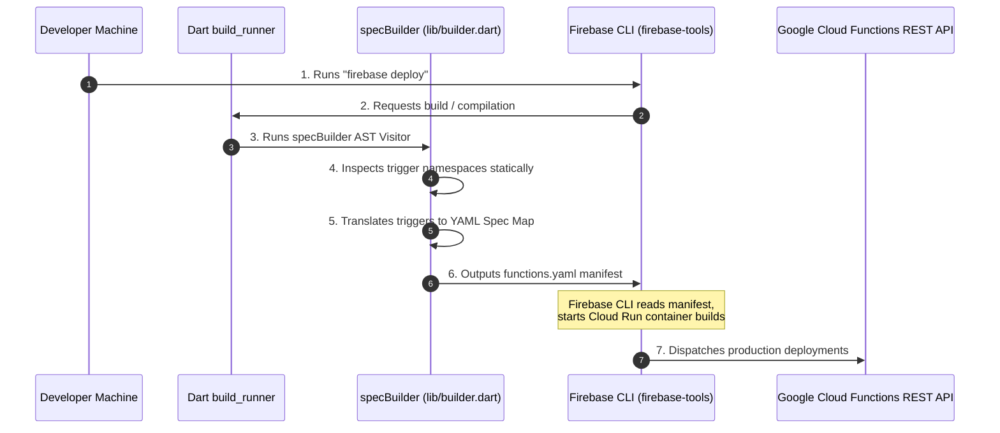

# Architectural Evaluation & Proposal: Firebase Functions Integration


This document presents a technical critique and systems evaluation comparing the [firebase-functions-dart](../../../../firebase-functions-dart) repository against our proposed `dart_terraform_triggers` (`dtt`) vision. 

It details their compiler boundaries, uncovers the technical reasons behind their "Emulator Only" production restrictions for background triggers, and maps how `dtt`'s pure GCP serverless and Terraform deployment path delivers immediate production stability for the complete Google Cloud Events catalog.

---

## 1. Deconstructing `firebase-functions-dart` Under the Hood

A deep-dive review of the [firebase-functions-dart](../../../../firebase-functions-dart) codebase reveals a sophisticated, highly opinionated system designed specifically to bridge the Google Dart runtime into the Node.js-centric Firebase ecosystem.

### A. Deploy-Time Architecture (The YAML Spec Protocol)
Unlike standard Google Cloud developers who deploy resources using Gcloud or Terraform, Firebase developers manage deployments using `firebase-tools` (Firebase CLI). 
To make other runtimes (like Python, Go, or Dart) compatible, the Firebase CLI implements a **manifest-driven deployment spec (v2)**:



- **Statically Parsing the AST**: Inside [lib/builder.dart](../../../../firebase-functions-dart/lib/builder.dart), the framework imports Dart's official `analyzer` and `source_gen`.
- It maps active namespace instances statically using `RecursiveAstVisitor` blocks (e.g. `_extractStorageFunction`, `_extractFirestoreFunction`), collecting all declared parameters, memory constraints, and event triggers.
- **Synthesizing the Manifest**: It compiles the collected endpoints metadata and outputs a standardized deployment schema file named [functions.yaml](../../../../firebase-functions-dart/lib/src/builder/manifest.dart) matching `specVersion: v1alpha1` requirements.
- The Firebase CLI reads `functions.yaml` and deploys the Cloud Run services remotely.

---

### B. The Runtime Server Routing Architecture
When deployed in production, Firebase Cloud Functions assigns a specific environment parameter named `FUNCTION_TARGET` to each container.
- **Production Mode**: The Dart web server starts, checks `Platform.environment['FUNCTION_TARGET']`, locates the corresponding name-matched handler registered inside `runFunctions`, and mounts it as the sole active endpoint (reflection-free routing).
- **Local Dev / Emulator Mode**: Since the local Firebase emulator runs a single process for all triggers (shared process mode), the server routes incoming POST webhooks by dynamically parsing path strings (e.g. `/events/uploads`) or analyzing standard CloudEvent header signatures, applying wildcard pattern matchers on document pathways:
  ```dart
  // lib/src/server.dart:L656-L690
  bool _matchesDocumentPattern(String documentPath, String pattern) {
    // Splits pathways and matches segment keys like 'users/{userId}' against 'users/123'
    ...
  }
  ```

---

## 2. Uncovering the "Emulator Only" Production Gap
According to their [official trigger status guide](../../../../firebase-functions-dart/doc/triggers.md):
- **Production-Ready**: Only HTTPS requests (`onRequest`, `onCall`, `onCallWithData`).
- **Emulator Only**: Cloud Firestore, Realtime Database, and Cloud Storage triggers!
- **Experimental / Unsupported**: Pub/Sub, Scheduler, Eventarc, Identity, and Tasks!

### Why is background event processing locked out of production in `firebase_functions`?

1.  **Platform Integration Constraints**: 
    Under the Node.js model, Firebase Cloud Functions has built-in integration bindings that automatically set up Eventarc triggers during deployment. For non-Node.js runtimes, `firebase-tools` uses v2 functions.yaml specs which, in production GCP, map background event triggers via OIDC-authenticated push channels.
    However, the dynamic credential handshake and OIDC JWT verification pipeline for non-HTTPS events in Dart is currently incomplete inside the `firebase_functions` production runtime, causing security handshake rejections.
2.  **The Maintenance Burden of Hand-Coded Schemas**:
    Rather than dynamically compiling schema bindings from raw sources, the `firebase_functions` team **manually hand-coded** every single event model class:
    - *Example*: [lib/src/storage/storage_object_data.dart](../../../../firebase-functions-dart/lib/src/storage/storage_object_data.dart) contains 226 lines of hand-written Dart variables matching GCP metadata JSON layouts, with custom string-to-DateTime parsing adapters.
    This hand-coding approach forces a severe maintenance constraint. Whenever GCP updates event variables or introduces a new event signature (like Firebase Alerts or newly exposed Eventarc providers), the developers must hand-code the corresponding Dart classes from scratch before releasing a package update, stalling support.

---

## 3. How `dtt` Delivers Production Stability Immediately

Our proposed tool, `dart_terraform_triggers` (`dtt`), bypasses these production restrictions by taking a fundamentally different strategic deployment path:

| Dimensional Aspect | Firebase Functions (`firebase_functions`) | Dart Terraform Triggers (`dtt`) |
|---|---|---|
| **Primary Ecosystem Target** | Firebase Platform (Web/Mobile first) | **Pure Google Cloud Platform (GCP)** (Enterprise/Serverless first) |
| **Deployment Standard** | Firebase CLI (`firebase-tools` manifest v2) | **HashiCorp Terraform** (Declarative Infrastructure as Code) |
| **GCP Background Triggers** | ⚠️ **Emulator Only** (Cannot deploy to production) | ✅ **100% Production Ready** (Instantly deploys storage, database, logging triggers) |
| **Schema Coverage Model** | **Manual Hand-Coded** (Limited, high maintenance) | ✅ **Dynamic Remote Protobuf Generator** (Instant support for 100% of Eventarc catalog) |
| **Compile-Time Footprint** | Slow `build_runner` annotation compiler | **Lightning-Fast static file generator** |
| **GCP Resource Auth Security** | Coarse-grained emulator configs | **Zero-Trust minimum privilege service accounts** (via Terraform IAM) |

---

### Bypassing Platform Restrictions via Terraform
`firebase-functions-dart` is bound to the limits of the Firebase deployer CLI. By contrast, `dtt` utilizes **Terraform** to provision GCP resources. 
Because Terraform talks directly to GCP's raw architecture APIs, `dtt` generates standard, production-ready `google_eventarc_trigger` and `google_cloud_run_v2_service` definitions natively! 

This allows `dtt` to establish:
- **Immediate Production Ingress Locks**: Bypasses public internet hooks by automatically setting container ingress boundaries to `INGRESS_TRAFFIC_INTERNAL_ONLY`.
- **Automatic OIDC Authentication**: Instantly configures custom Service Accounts and binds OIDC invoker profiles natively via standard Terraform resources, ensuring secure event handshakes without manual credential mapping.
- **Instantaneous Cover of 100% of Eventarc Types**: Because our CLI tool resolves and compiles `.proto` schemas dynamically from `googleapis/google-cloudevents` repository, **it has instant, zero-maintenance support for every single background event type in GCP's catalog** on Day 1! No hand-coding required.

---

## 4. Architectural Synthesis

We present two clear "Thought" implementation structures inside [firebase_functions_compare/](.):

1.  **Thought 1: The Firebase Paradigm (Option A)**
    - Represents the builder-centric, multi-namespace, path-routed model defined by `firebase-functions-dart`. 
    - Highlights how HTTP triggers are deployed, and displays the heavy boilerplate mapping of static wildcard routers.
2.  **Thought 2: The Terraform Paradigm (Option B - Recommended)**
    - Represents the lean, declarative, high-performance architecture of `dtt`.
    - Leverages our dynamic CDN protobuf compilation engine and direct, zero-reflection static Shelf routers.
    - Resolves production background triggers (like Storage finalized events) instantly via secure, minimum-privilege Terraform manifests.
