# Architectural Evaluation & Proposal: Functions Framework Integration


This document provides a deep technical review and structural proposal analyzing the integration path between our proposed `dart_terraform_triggers` (`dtt`) library and the official Google-supported [functions-framework-dart](https://github.com/GoogleCloudPlatform/functions-framework-dart) package. 

It maps their codebase patterns, uncovers standard integration barriers, evaluates technical choices, and details three strategic paths: **Build On Top**, **Reimagine / Replace**, and the **Hybrid Upstream** approach.

---

## 1. Deconstructing the `functions-framework-dart` Monorepo

Following a structural review of the [functions-framework-dart](https://github.com/GoogleCloudPlatform/functions-framework-dart) repository, the system relies on a two-part monorepo architecture leveraging Native Dart Workspaces and Melos:

1.  **`functions_framework` (Runtime Library)**:
    - Sets up a standard [shelf](https://pub.dev/packages/shelf) server equipped with termination handlers and connection configurations.
    - Exposes annotations (`@CloudFunction()`) and defines a generic [CloudEvent](https://github.com/GoogleCloudPlatform/functions-framework-dart/blob/main/functions_framework/lib/src/cloud_event.dart) payload model.
    - Implements HTTP CloudEvent bindings, parsing Binary and Structured payloads into Map or dynamic arrays.
2.  **`functions_framework_builder` (Annotation Code-Gen Compiler)**:
    - Runs at build-time using Dart's standard `build_runner` framework.
    - Inspects a target-specific file (enforcing a strict naming path `lib/functions.dart`).
    - Resolves public, top-level functions decorated with `@CloudFunction`.
    - Automatically outputs the server entry point inside `bin/server.dart` which registers routing targets and invokes `serve()`.

---

## 2. Uncovering Developer Friction Gaps in the Current Ecosystem

While `functions-framework-dart` handles basic HTTP parsing and conforms to official Cloud Functions specs, a close audit of their runtime and examples reveals three severe friction boundaries:

### Gap 1: Complete Absence of Payload Type-Safety
In the current framework, event payloads inside `CloudEvent` are completely generic:
```dart
// functions_framework/lib/src/cloud_event.dart
final Object? data;
```
When receiving a Google Cloud Event (e.g., Firestore document mutations or Storage uploads), the developer receives a raw JSON Map, JSON String, or byte buffer. To extract data fields, developers must write manual casts and parsing steps:

```dart
// official examples/protobuf_firestore/lib/functions.dart
@CloudFunction()
void function(CloudEvent event, RequestContext context) {
  // Manual type-unsafe cast and model parsing!
  final instance = DocumentEventData.fromBuffer(event.data as List<int>);
  print('Document updated: ${instance.value.name}');
}
```
This forces developers to hunt down JSON layouts on documentation portals and manually type map-string index keys, representing a high vulnerability vector for runtime crashes.

### Gap 2: High Proto Schema Compilation Overhead
The official `protobuf_firestore` sample demonstrates the current method for compiling Google Cloud Events schemas into Dart classes. It relies on a shell script [examples/protobuf_firestore/tool/regenerate_protos.sh](https://github.com/GoogleCloudPlatform/functions-framework-dart/blob/main/examples/protobuf_firestore/tool/regenerate_protos.sh):
- Developers **must manually clone** the colossal `googleapis/googleapis` repository locally.
- Developers **must manually clone** the `googleapis/google-cloudevents` schema repository.
- Developers configure environment variables `GOOGLEAPIS` and `GOOGLE_CLOUD_EVENTS` pointing to local checkout folders.
- Running the compiler references paths to search paths:
  ```bash
  protoc -I$GOOGLEAPIS -I$GOOGLE_CLOUD_EVENTS/proto --dart_out="lib/src" google/events/cloud/firestore/v1/data.proto ...
  ```
This is a manual, environment-dependent step that is extremely difficult to coordinate in typical continuous integration (CI) or developer workflows.

### Gap 3: Infrastructure Gaps (No Terraform Integration)
`functions-framework-dart` handles request routing inside containers but is completely disconnected from infrastructure deployment. Developers are left to construct complex Terraform modules, configure service accounts, declare push topics, and align IAM OIDC invoker parameters manually.

---

## 3. The Three Strategic Architecture Options

To establish our proposed project `dtt`, we present three design paths, evaluating the specific performance, security, and developer productivity tradeoffs of each.

```mermaid
graph TD
    subgraph Option 1: Build On Top
        dtt1[dtt CLI Engine] -->|Automates Code-Gen| FB[lib/functions.dart]
        FB -->|build_runner| FFB[functions_framework_builder]
        FFB -->|Generates server| FFServe[functions_framework/serve.dart]
    end

    subgraph Option 2: Reimagine / Replace
        dtt2[dtt CLI Engine] -->|Direct Code-Gen| StaticServe[bin/server.dart]
        StaticServe -->|Static Router| Handlers[Typed Handlers]
        style Option 2: Reimagine / Replace fill:#3d1a5c,stroke:#a35cf0,stroke-width:2px
    end

    subgraph Option 3: Hybrid Upstream
        dtt3[dtt CLI Engine] -->|Upstream PR| GenericFF[Typed functions_framework]
    end
```



---

### Option 1: "Build On Top" (Leverage, Wrap & Automate)

We treat `functions_framework` as the runtime web server engine and annotation executor. `dtt` acts as an **outer orchestrator, schema resolver, type-safe wrapper, and infrastructure generation layer**.

#### How the Workflow Maps:
1.  Developer adds triggers to [dtt.yaml](../dtt.yaml).
2.  `dtt` automatically resolves the target event schema via Google's Eventarc API.
3.  `dtt` downloads only the specific target proto files and dependencies from GitHub and compiles them under `.dart_tool/dtt/` using `protoc` (solving the manual monorepo dependency cloning problem).
4.  `dtt` automatically generates [lib/functions.dart](../lib/functions.dart), acting as the annotated facade wrapping `functions_framework`'s generic engine. It auto-unpacks dynamic payloads into type-safe models before forwarding them to the developer:
    ```dart
    // lib/functions.dart (Auto-generated by dtt)
    import 'package:functions_framework/functions_framework.dart';
    import 'src/generated/google/events/cloud/storage/v1/data.pb.dart';
    import 'src/handlers/on_upload.dart';

    @CloudFunction()
    void onStorageUpload(CloudEvent event, RequestContext context) {
      // Automatic robust parsing pipeline!
      final typedPayload = StorageObjectData.fromBuffer(event.data as List<int>);
      onUpload(event, typedPayload, context);
    }
    ```
5.  `dtt` triggers the `build_runner` compilation phase to generate `bin/server.dart`.
6.  `dtt` packages the build and deploys the infrastructure via the generated Terraform files.

#### Tradeoff Matrix:
-   👍 **Pros**:
    -   Leverages Google's officially conformant HTTP payload-parsing pipelines and environment signal configurations.
    -   Simplest path to maintain long-term alignment with changes in the standard Google runtime boundaries.
    -   No need to recreate custom GCP metadata lookup servers or Structured Logging JSON log writers.
-   👎 **Cons**:
    -   Forces the slow overhead of running Dart's `build_runner` code generator at compile-time.
    -   Payloads undergo double serialization parsing (envelope parsed first as a generic JSON map, and data block parsed again to Protobuf models).

---

### Option 2: "Reimagine / Replace" (Static, Optimized Micro-Engine)
> [!TIP]
> **RECOMMENDED DESIGN PATH**
> 
> This approach delivers maximum runtime performance, accelerates cold-start times, and completely eliminates the compile-time friction of `build_runner`.

We bypass `functions_framework` entirely. `dtt` provides a **lightweight runtime package and CLI compiler in one**, generating completely **static Shelf servers** containing strongly-typed routing blocks.

#### How the Workflow Maps:
1.  Developer declares triggers and service configurations inside [dtt.yaml](../dtt.yaml).
2.  `dtt` maps, fetches, and compiles schema bindings (exactly as in Option 1).
3.  Instead of annotations and build runner, `dtt generate` outputs a **completely static, highly readable routing server** inside `bin/server.dart` mapping pointer indices:
    ```dart
    // bin/server.dart (Auto-generated by dtt)
    import 'dart:io';
    import 'package:shelf/shelf.dart';
    import 'package:shelf/shelf_io.dart' as shelf_io;
    import 'package:google_cloudevents/storage_object_data.pb.dart';
    
    // Import generated middleware & core parsers
    import 'package:dart_terraform_triggers/cloudevents.dart';
    import 'package:my_service/handlers/on_upload.dart';

    void main() async {
      final pipeline = const Pipeline()
        .addMiddleware(dttLoggingMiddleware()) // GCP structured log logging!
        .addHandler(_router);

      final server = await shelf_io.serve(pipeline, InternetAddress.anyIPv4, 8080);
      print('Listening on port \${server.port}');
    }

    Future<Response> _router(Request request) async {
      final String eventType = request.headers['ce-type'] ?? '';
      
      switch (eventType) {
        case 'google.cloud.storage.object.v1.finalized':
          // Zero-reflection parsing straight to type-safe container:
          final event = await CloudEvent.parse<StorageObjectData>(
            request, 
            (bytes) => StorageObjectData.fromBuffer(bytes)
          );
          await onUpload(event);
          return Response.ok('OK');
          
        default:
          return Response.notFound('Unsupported target event: \$eventType');
      }
    }
    ```
4.  `dtt deploy` packages and deploys the system via Terraform.

#### Tradeoff Matrix:
-   👍 **Pros**:
    -   **Blazing Performance**: Pure Dart compilation with zero runtime reflection and zero dynamic symbol lookups.
    -   **Eliminates Build Runner**: No need to maintain complex annotation builders. Compilations run immediately.
    -   **Lightning Cold Starts**: Micro-engine maps static routing pointers immediately at startup, optimizing Google Cloud Run scale-up execution bounds.
    -   **Total System Control**: Allows us to embed custom OIDC header checks, JWT verifications, and custom logging middleware cleanly.
-   👎 **Cons**:
    -   Requires authoring a standard request parser and structured logger mapping GCP formats (which is straightforward and documented in our architecture guides).

---

### Option 3: "Hybrid Upstream & Extend" (The Upstream Path)

We propose adding native event generic typing directly to the upstream `functions-framework-dart` repository, updating the annotations processor to compile schemas natively.

#### How the Workflow Maps:
1.  Submit an upstream contribution modifying `CloudEvent` to accept type arguments:
    ```dart
    class CloudEvent<T> {
      final T data;
    }
    ```
2.  Extend the annotations compiler `functions_framework_builder` to inspect `@CloudFunction` parameters and extract type names (e.g., `DocumentEventData` or `StorageObjectData`).
3.  The generator synthesizes the exact serialization bindings mapping these target types.

#### Tradeoff Matrix:
-   👍 **Pros**:
    -   A massive contribution that upgrades Dart's backend developer community with type-safety out of the box.
-   👎 **Cons**:
    -   **Extremely Slow Execution Cycle**: Navigating upstream code reviews, licensing agreements, release coordinate cycles, and version publishes can take months.
    -   The user cannot utilize the typing features immediately as they are blocked by official system dependency releases on pub.dev.

---

## 4. Proposal Comparison Matrix

| Dimensional Metric | Option 1: Build On Top | Option 2: Reimagine / Replace (Recommended) | Option 3: Upstream Path |
|---|---|---|---|
| **Runtime Performance** | Moderate (Double parsing dynamic payloads) | **Maximum** (Static switch, single-pass parsing) | Moderate (Double parsing dynamic maps) |
| **Startup / Cold Starts** | Good | **Excellent** (No reflection registry steps) | Good |
| **Local Dev Loop Latency** | Slow (Heavy dependency on `build_runner`) | **Instantaneous** (Static file generators) | Slow (Heavy dependency on `build_runner`) |
| **Ease of Local Testing** | Complex (Requires build runners and configuration files) | **Simple** (Standard Dart scripts, direct imports) | Complex (Requires build runners) |
| **Platform Compatibility** | High (Passes standard conformance tests) | High (Easily structured to conform to HTTP models) | High (Official conformant library) |
| **Vulnerability Boundary** | Low | Low (Enforces tight, static route structures) | Low |
| **Time to Execution** | Fast | **Immediate** | Very Slow (Blocked by PR loops) |

---

## 5. Summary Recommendation

We strongly recommend **Option 2: Reimagine / Replace with a Static Micro-Engine**. 

It eliminates the single largest friction point of the existing framework—the reliance on Dart's complex, slow annotation `build_runner`—while providing **uncompromising type-safety**, **instantaneous local runs**, and **maximum runtime performance** for serverless scaling. 

This approach fully aligns with Dart 3.12+'s modern AOT target optimization paradigms, giving developers a premium, high-fidelity experience that feels light years ahead of the current monorepo's manual patterns.
