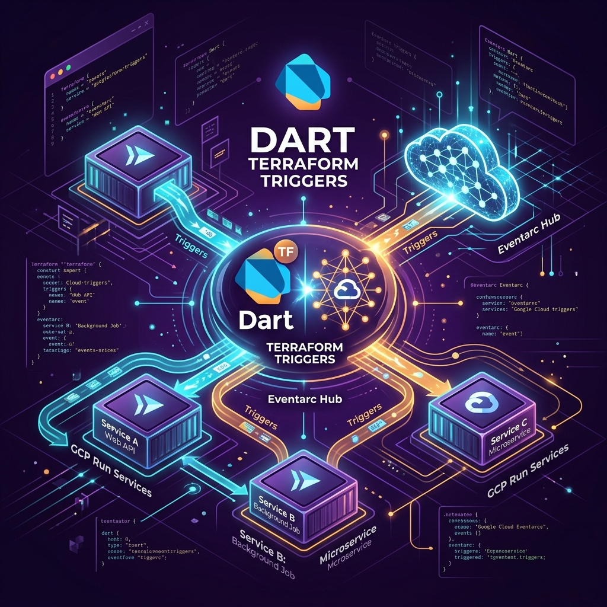

# Phased Implementation & Execution Plan

This document maps the actionable, phase-by-phase implementation schedule to construct the `dart_terraform_triggers` (`dtt`) CLI tool and library. It identifies tasks, required assets, filesystem mappings, testing milestones, and incorporates the formal securecoder security audit and verification plan.

---

## 1. Project Scaffolding & CLI Engine (Phase 1)

**Objective**: Establish the repository framework, package definitions, CLI command router, and local configuration engine.

- [ ] **Task 1.1: Initialize Monorepo Package Workspace**
  - Configure the root [pubspec.yaml](../pubspec.yaml) establishing the Native Dart Workspace.
  - Create global workspace lints inside [analysis_options.yaml](../analysis_options.yaml).
  - Scaffold package directories and their corresponding configurations:
    - `packages/dtt_runtime`: Core event routing middleware. Depends on: `shelf`, `protobuf`, `google_cloud_shelf`.
    - `packages/dtt`: CLI developer tooling agent. Depends on: `args`, `yaml`, `http`, `path`, `process`.
    - `packages/google_cloud_events`: Standalone pre-compiled event models. Depends on: `protobuf`.
- [ ] **Task 1.2: Build CLI Entrypoint & Developer Compiler**
  - Scaffold CLI execution entrypoint in `packages/dtt/bin/dtt.dart`.
  - Implement CLI command runner mapping in `packages/dtt/lib/src/cli/runner.dart` extending `CommandRunner`.
  - Program developer catalog compiler `packages/dtt/lib/src/dev/cloudevents_compiler.dart` compiling raw `.proto` definitions recursively from sibling clones.
  - Create command subclasses in `packages/dtt/lib/src/cli/commands/`:
    - `init.dart` $\rightarrow$ Initial workspace scaffold (scaffolding client dependencies on `dtt_runtime` and `google_cloud_events`).
    - `trigger_list.dart` $\rightarrow$ Discovery and trigger catalog enumeration.
    - `trigger_add.dart` $\rightarrow$ Resolves trigger configurations.
    - `generate.dart` $\rightarrow$ Runs model compilations, registers Shelf event routes, and synchronizes Terraform templates.
    - `deploy.dart` $\rightarrow$ Runs Docker image packaging and executes Terraform provisioning.
- [ ] **Task 1.3: Design Local Configuration Parser**
  - Build the configuration loader in `packages/dtt/lib/src/cli/config.dart` resolving root [dtt.yaml](../dtt.yaml) settings.
  - Apply strict string regex validation on GCP attributes (Project IDs, service naming, regions) to block directory and shell injection vulnerabilities.

*Milestone*: Running `dart bin/dtt.dart --help` returns clean, well-formatted help menus for all commands.

---

## 2. Dynamic Schema Discovery & Remote Fetcher (Phase 2)

**Objective**: Connect to Google API endpoints and remote repositories to identify Eventarc trigger options and pull structural event schemas.

- [ ] **Task 2.1: Establish GCP API Integrations**
  - Implement the GCP Client in `packages/dtt/lib/src/discovery/gcp_client.dart`.
  - Integrate `googleapis` authentication mechanisms mapping local credentials.
  - Use `projects.locations.providers.list` and `projects.locations.providers.eventTypes.list` to query GCP directly for active Eventarc types.
- [ ] **Task 2.2: Event Catalog Database & Model Cache**
  - Create a static metadata dictionary mapping popular Google Services to their corresponding files inside the Google CloudEvents repository:
    - File: `packages/dtt/lib/src/discovery/catalog.dart`.
  - Implement a HTTP Schema Downloader targeting the official `raw.githubusercontent.com/googleapis/google-cloudevents` repository.
  - Save downloaded `.proto` resources to a local workspace cache folder `.dart_tool/dtt/schemas/`. Ensure parents are resolved.

*Milestone*: Running `dtt trigger list` displays a clear catalog of active Eventarc triggers, and downloading schemas successfully populates the cache folder under `.dart_tool`.

---

## 3. Protobuf Dart Binding Compiler (Phase 3)

**Objective**: Automatically translate standard Google Event schemas into fully type-safe Dart classes using the protocol buffers compilation tools.

- [ ] **Task 3.1: Build Compilation Invoker**
  - Program the compilation engine inside `packages/dtt/lib/src/codegen/protoc_runner.dart`.
  - Detect system installation of `protoc` and the Dart `protoc_plugin` wrapper. Warn and direct users if missing.
  - Invoke `Process.run` to compile fetched schemas.
    - *Critical Security Requirement*: Avoid plain command concatenations; pass parameters as discrete list arrays to prevent command injections.
- [ ] **Task 3.2: Transitive Dependency Resolver**
  - Standard event definitions from Google often import standard types (e.g., `google/protobuf/timestamp.proto` or `google/events/cloudevents.proto`).
  - Update the fetching logic to parse `.proto` import directives recursively, ensuring all required dependencies are downloaded before compilation runs.

*Milestone*: Adding `google.cloud.storage.object.v1.finalized` stubs type-safe Dart representation classes in `packages/google_cloud_events/lib/google/events/cloud/storage/v1/data.pb.dart`.

---

## 4. CloudEvents Middleware & Stub Scaffolder (Phase 4)

**Objective**: Code the runtime parser recognizing Binary/Structured CloudEvents formats and generate starter trigger-handler callbacks.

- [ ] **Task 4.1: Implement Unified CloudEvent Parser**
  - Build the parsing engine in `packages/dtt_runtime/lib/cloudevents.dart`.
  - Parse metadata out of either Binary Mode HTTP request headers (e.g. `ce-type`, `ce-source`) or Structured Mode JSON envelope elements in the POST payload body.
  - Decouple parsing parameters; parse the body either into standard JSON representations or directly map into custom dynamic buffers depending on context.
- [ ] **Task 4.2: Callback Stub Scaffolder**
  - Create the template generator inside `packages/dtt/lib/src/codegen/handler_stub.dart` and define event extension mapping stubs leveraging upstream client libraries (e.g. `package:google_cloud_storage`).
  - Scaffold a Shelf server bootstrap setup in `bin/server.dart` mapping path hooks (e.g., `/events/uploads`) to custom callbacks.
  - Automatically stub event callbacks with strong types (e.g. `CloudEvent<StorageObjectData>`) inside the target source directory `lib/src/handlers/`.

*Milestone*: Incoming Eventarc HTTP triggers are dynamically routed, successfully matching headers and mapping payload bodies into compiled models.

---

## 5. Automated Terraform Synthesis (Phase 5)

**Objective**: Translate declarative [dtt.yaml](../dtt.yaml) triggers configuration blocks into production-ready, highly secure Terraform configuration assets.

- [ ] **Task 5.1: Create Terraform Config Scaffold**
  - Program the synthesis engine inside `packages/dtt/lib/src/codegen/terraform_gen.dart`.
  - Generate three standard files in `terraform/`:
    - `main.tf` $\rightarrow$ Structural GCP resources (Service accounts, triggers, run services).
    - `variables.tf` $\rightarrow$ Configurable deployment arguments.
    - `outputs.tf` $\rightarrow$ Target metrics (Service url, trigger id).
- [ ] **Task 5.2: Enforce Zero-Trust Resource Scopes**
  - Constrain ingress: Default service configuration blocks inside `main.tf` to `INGRESS_TRAFFIC_INTERNAL_ONLY` restricting traffic.
  - Minimize IAM privilege profiles: Automatically bind Eventarc Triggers using custom dedicated Service Accounts rather than generic project owner definitions.

*Milestone*: The `dtt generate` command outputs well-formatted, valid Terraform files in `terraform/` matches local config parameters exactly.

---

## 6. Containerization & Production Deployment Engine (Phase 6)

**Objective**: Automate compiling release builds, running image container construction pipelines, and invoking Terraform orchestration commands.

- [ ] **Task 6.1: Standard Containerizer Wrapper**
  - Write standard Docker wrappers in `packages/dtt/lib/src/deployer/docker_builder.dart`.
  - Generate a secure, multi-stage `Dockerfile` optimized for Dart performance (compiling statically-linked AOT release builds).
  - Orchestrate local Docker builds, or delegate directly to Google Cloud Build.
- [ ] **Task 6.2: Terraform Execution Integration**
  - Program the runner engine inside `packages/dtt/lib/src/deployer/terraform_runner.dart`.
  - Invoke list-bound system commands sequentially:
    1. `terraform init`
    2. `terraform validate`
    3. `terraform apply -auto-approve`

*Milestone*: Invoking `dtt deploy` processes container compilation, uploads image assets, and safely runs resource provisioning, rendering a live endpoint on GCR.

---

## 7. Quality Verification & Testing Plan (Phase 7)

**Objective**: Establish deep unit and integration testing coverage leveraging standard Dart testing paradigms and hermetic environment tools.

- [ ] **Task 7.1: Build Unit Test Coverage Suite**
  - Write tests under [test/cloudevents_test.dart](../test/cloudevents_test.dart) checking:
    - Binary parsing headers validation.
    - Structured JSON envelope extraction.
    - Faulty payload exception handlings and formatting fallbacks.
  - Implement mock verification tests under [test/discovery_test.dart](../test/discovery_test.dart) verifying API mock models.
- [ ] **Task 7.2: Build CLI Hermetic Integration Testing Suite**
  - Establish a comprehensive integration pipeline in `test/cli_test.dart`.
  - Utilize `package:test_process` and `package:test_descriptor` to construct isolated sandbox directories containing virtual templates.
  - Test command sequences: verify that calling `dtt init` accurately initializes structures and check that `dtt generate` successfully compiles schemas.

---

## 8. Verification Plan

To ensure security, stability, and standard conformity, the implementation cycle will complete under strict verification policies:

### 1. Automated Security Check

- **Security Scanner**: Prior to final merge, execute our native automated security scanner `run_security_scanner` on all newly created files in `packages/dtt/` and `packages/dtt_runtime/`. This identifies standard codebase vulnerabilities (XSS, script injection pathways, SQL injections). Any findings must be immediately corrected.
- **Security Audit**: Audit all newly constructed execution code blocks checking:
  - Strict inputs sanitization and regex validation on all files and environment paths.
  - Standard list parameters execution patterns on process spawns.
  - Enforced JWT and OIDC token validation on server gateways.
  - Absolute exclusion of hardcoded keys or testing secrets.
  - Document all design-level security assessments in `walkthrough.md` using standard auditing tools.

### 2. Standard Diagnostics & Compilation Checks

Verify all codes achieve:
- **Zero Analyzer Warnings & Errors**: Running `dart analyze` returns green.
- **Flawless Code Format Style**: Running `dart format --output=none --set-exit-if-changed .` passes.
- **Complete Test Verifications**: All unit and integration test runs pass.
