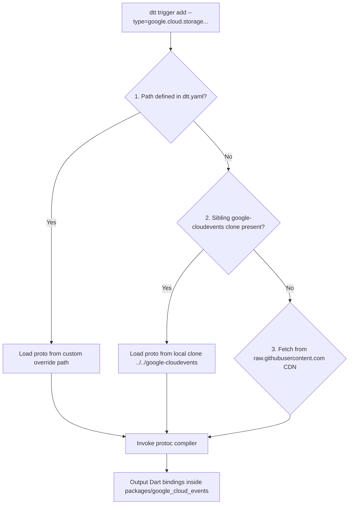
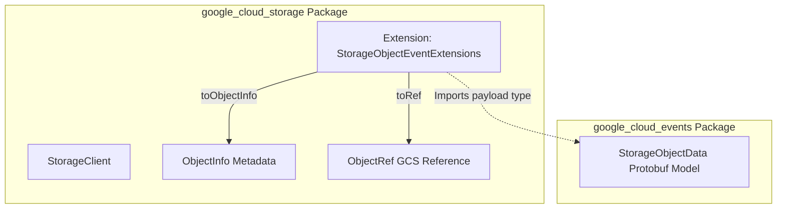

# Package Distribution Plan: Core Decoupling & Ecosystem Design


This document establishes the official packaging and distribution strategy for the `dart_terraform_triggers` project. To ensure maximum runtime performance, ultra-lightweight serverless execution footprints, and a premium developer experience, the project is structured as a **split-package monorepo** with a clear roadmap to integrate into the official Google Cloud Dart ecosystem.

---

## 1. The Package Ecosystem Matrix

To eliminate massive transitive dependency chains and avoid package version conflicts at runtime, the codebase is divided into three distinct packages under the `/packages` workspace pathway:

```
dart_terraform_triggers/ (Monorepo Workspace Root)
├── pubspec.yaml (Workspace mapping)
├── docs/
│   └── package_distribution_plan.md (This plan)
└── packages/
    ├── dtt/ (CLI Developer Tooling Suite)
    ├── dtt_runtime/ (Core Event Routing Webserver Middleware)
    └── google_cloud_events/ (Pre-compiled GCP Event Models)
```

---

### A. `packages/dtt` (The Tooling Suite & CLI Agent)
*   **Purpose**: Shipped as a developer-facing tool, globally activated via `dart pub global activate dtt`. It drives project initialization, dynamic schema compilation, Terraform manifest synthesis, and production container builds.
*   **Dependencies**: Heavy, workstation-targeted utility libraries:
    *   `args`: Terminal command execution.
    *   `yaml`: Parsing declarative workspace configurations.
    *   `http`: Accessing GCP APIs and downloading distant schemas.
    *   `path`: Environment-aware filesystem resolution.
    *   `process`: Orchestrating `protoc`, `docker`, and `terraform` system invocations.
*   **Target Scope**: Exclusively active during the developer’s local work-loop. Never linked into production container images.

---

### B. `packages/dtt_runtime` (The Core Event Webserver Engine)
*   **Purpose**: The lightweight runtime framework imported directly into serverless Cloud Run container endpoints.
*   **Strategy (Bypassing Custom Platform Boilerplate)**: Bypasses custom platform boilerplates by importing and wrapping the official, Google-supported **`package:google_cloud_shelf`**. This gives us native structured logging, GCS trace correlations, HTTP exception mappings, and SIGTERM termination handling out-of-the-box, letting `dtt_runtime` focus solely on event routing.
*   **Dependencies**: Kept extremely lightweight to ensure blazing cold-starts and clean package resolutions:
    *   `shelf`: Core webserver plumbing.
    *   `protobuf`: Native deserialization engine.
    *   `google_cloud_shelf`: Graceful GCP server integrations.
*   **Contents**: `CloudEvent<T>` generic data mapper, binary/structured webhook request headers parser, OIDC request authenticator, and direct route index mapping handlers.

---

### C. `packages/google_cloud_events` (Pre-compiled GCP Event Models)
*   **Purpose**: Shipped as a standalone model library containing pre-compiled Dart Protobuf classes representing 100% of Eventarc's official GCP background event types.
*   **Long-Term Roadmap**: Lives inside this workspace temporarily during development, with a clear drop-in roadmap to migrate permanently to the official client monorepo at **[googleapis/google-cloud-dart](https://github.com/googleapis/google-cloud-dart)** under the `pkgs/google_cloud_events` namespace in the long-term.
*   **Dependencies**: Pure, dependency-free (except for standard `protobuf`). Instantly compiles without developer-side protoc generator dependencies.

---

## 2. Dynamic Schema Compilations & Sibling Code Lookup

To enable rapid local loop feedback for the Dart team while ensuring out-of-the-box functionality for community members, the CLI (`dtt`) implements a **Smart Sibling Resolver Sequence** when fetching raw `.proto` schema definitions during trigger additions:



### Zero-Maintenance Automation Developer Command
To effortlessly maintain and update `google_cloud_events` in sync with raw GCP schema expansions, the `dtt` CLI houses a hidden developer command that compiles the entire catalog at once:

```bash
dtt dev compile-catalog --source=/Users/kevmoo/github/google-cloudevents
```
This maps over the 37+ raw Google Cloud service subfolders (e.g. `storage`, `firestore`, `pubsub`), executes standard `protoc` compilations recursively, generates index libraries, and yields a complete, release-ready `google_cloud_events` Dart package in seconds.

---

## 3. Upstream Extension Pattern: Tight Coupling with Client Packages

To integrate background triggers natively with official APIs (e.g. `google_cloud_storage`, `google_cloud_firestore`) without creating massive circular dependencies or bloat inside the pure schema library, **tight coupling is inverted using Dart Extension Methods**.

Instead of `google_cloud_events` importing client packages, **each client package in `google-cloud-dart/pkgs` imports `google_cloud_events`** and defines native transition and mapping helpers:



### Concrete Code Example (Inside `google_cloud_storage`)
Inside `package:google_cloud_storage`, we define extension mappings on the `StorageObjectData` event class payload:

```dart
// packages/google_cloud_storage/lib/src/event_extensions.dart
import 'package:google_cloud_events/google/events/cloud/storage/v1/data.pb.dart';
import 'package:google_cloud_storage/google_cloud_storage.dart';

extension StorageObjectEventExtensions on StorageObjectData {
  /// Maps the Eventarc trigger GCS payload variables straight to a standard 
  /// google_cloud_storage metadata model.
  ObjectInfo toObjectInfo() {
    return ObjectInfo(
      bucket: bucket,
      name: name,
      size: int.parse(size),
      contentType: contentType,
      updated: DateTime.parse(updated),
    );
  }

  /// Exposes a direct, type-safe client pointer model mapping the active 
  /// storage bucket context.
  ObjectRef toRef(StorageClient storage) {
    return storage.bucket(bucket).object(name);
  }
}
```

### Unified Developer Experience
Developers importing both packages inside their event microservice gain clean, autocompleted, type-safe integration methods with zero configuration mapping boilerplates:

```dart
import 'package:google_cloud_events/google/events/cloud/storage/v1/data.pb.dart';
import 'package:google_cloud_storage/google_cloud_storage.dart';
import 'package:dtt_runtime/cloudevents.dart';

void onStorageUpload(CloudEvent<StorageObjectData> event, StorageClient storage) async {
  // 1. Instantly read file size and timestamps through client types!
  final ObjectInfo info = event.data.toObjectInfo();
  
  // 2. Perform actions on GCS using standard, correlated references!
  final file = event.data.toRef(storage);
  final fileBytes = await file.read(); 
  print('Processed ${info.name} (${fileBytes.length} bytes)');
}
```

---

## 4. The Upstream Migration Roadmap

To ensure a seamless, drag-and-drop landing inside the official ecosystem long-term, the compilation targets are mapped cleanly.

### Phase A: Local Workspace Incubation
During the development phase of `dart_terraform_triggers`, all three packages are managed here as local monorepo workspaces. This permits rapid iterations and isolated hermetic integration testing on the CLI and runtime components.

### Phase B: Slicing Out `google_cloud_events`
Because `google_cloud_events` is kept schema-pure (dependency-free except for standard `protobuf`), migrating it represents a simple folder drag-and-drop:
1.  Copy `/packages/google_cloud_events` folder to the target repository under `google-cloud-dart/pkgs/google_cloud_events`.
2.  Add a reference to this sub-package in their root-level monorepo workspace configurations.
3.  Submit a single, clean upstream pull request to officially publish it under the Google publisher portal on pub.dev.

### Phase C: Landing Bridge Extensions
Submit pull requests to the individual official client directories (`pkgs/google_cloud_storage`, `pkgs/google_cloud_logging`, `pkgs/google_cloud_firestore`) adding the corresponding type-safe event extension mapping files.

At this checkpoint, `dtt` transitions from utilizing a local schemas target to pulling down the official, highly-integrated Google-supported library.
