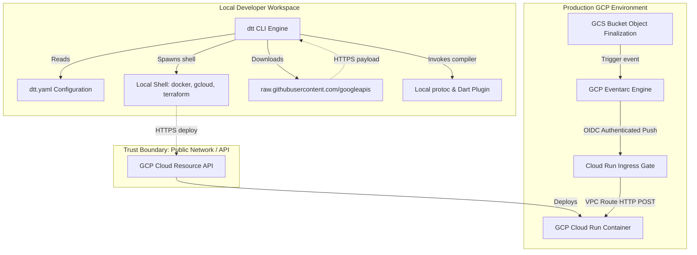

# Security Design & Threat Model Specification


This document maps out the comprehensive security boundaries, trust models, and sensitive data flows for the `dart_terraform_triggers` (CLI tool `dtt`) framework and the serverless microservices it provisions. It establishes security guidelines for local code-generation, remote schema downloads, container isolation, and deployment state storage.

---

## 1. Security Architecture Overview

The system operates across two discrete execution environments with an asymmetric security posture:

1. **Developer Workstation (Local CLI)**:
   - Evaluates developer-authored [dtt.yaml](file:///Users/kevmoo/github/kevmoo/dart_terraform_triggers/dtt.yaml) configurations.
   - Accesses Google Cloud Service Agent directories and local Docker instances.
   - Fetches event proto definitions from external sources.
   - Executes system commands to trigger compilation and deployment.
   - *Security Goal*: Prevent local privilege escalation, malicious CLI command injection, and storage of hardcoded access keys in repo logs.

2. **Google Cloud Run (Production Microservice)**:
   - Exposes webhooks processing Eventarc push messages.
   - Communicates with GCP APIs under a dedicated GCP Service Account identity.
   - Accesses secure storage elements in Google Cloud Storage or Cloud Firestore.
   - *Security Goal*: Maintain strong authentication of event senders, enforce strict boundaries around network ingress, and avoid exposing raw user event data in stdout logging.

---

## 2. System Boundaries & Attack Surface

The boundaries between zones are mapped below:



---

## 3. Threat Model Details

### Component Overview
The `dart_terraform_triggers` package serves as a development tool, code generator, and infrastructure provisioner. The end output is a Dart backend microservice run on a container, communicating asynchronously through Eventarc event queues on GCP.

### Entry Points and Untrusted Inputs

| Entry Point | Type | Trusted? | Validation |
|---|---|---|---|
| **dtt.yaml Configuration** | File Input | **Yes** (Developer-controlled) | Read using standard `package:yaml`. Requires schema checking on parameters to prevent shell injection via maliciously crafted service names. |
| **GCP Schema API / GitHub Protos** | Network Response | **No** (Remote Endpoint) | Downloaded over strict TLS (HTTPS). Protos are stored in isolated schema cache directories; parser syntax checking is enforced before compilation. |
| **CLI Flags / Inputs** | CLI Arguments | **Yes** (Developer-controlled) | Parsed via `package:args`. Rejects dangerous argument patterns to avoid process invocation hijack. |
| **GCR Webhook Target (`/events/*`)** | HTTP POST Request | **No** (Public HTTP endpoint) | Must be guarded by the GCP infrastructure. The generated Terraform templates force `INGRESS_TRAFFIC_INTERNAL_ONLY` and configure OIDC authentication. |

### Trust Boundaries and Auth Assumptions
- **Authentication**:
  - *Local CLI*: Relies entirely on GCP's official credentials system. No raw keys are requested; authorization is obtained from `gcloud auth application-default` or the standard `GOOGLE_APPLICATION_CREDENTIALS` environment variable.
  - *Production Webhook*: Authenticated using **OpenID Connect (OIDC) JWT tokens** generated by Eventarc. The webhook service checks that the token is valid, signed by Google, and belongs to the configured Trigger Service Account.
- **Authorization**:
  - *Trigger Permissions*: The Eventarc Service Agent must possess `roles/run.invoker` binding for the target Cloud Run service.
  - *Service Permissions*: The microservice container's service account uses "Principle of Least Privilege" (PoLP) and only contains roles corresponding to database access, logging, or bucket reads required by the event-handling business logic.
- **Implicit trust**: None. The system treats all raw HTTP packets hitting the network card as untrusted until validated by Google Front End (GFE) or container-level OIDC checks.

### Sensitive Data Paths

| Data Type | Source | Destination | Protection |
|---|---|---|---|
| **GCP Access Credentials** | Local Credential Helper | GCP Management API | Transmitted over standard TLS. Never written to generated build directories or git-tracked temporary folders. |
| **Terraform State File** | Terraform Engine | GCP bucket storage / Local state | Encrypted at rest. Local states are added to `.gitignore` to prevent leakage. |
| **Eventarc Event Payloads** | GCP Event Sources | Dart Application Logic | Enveloped in secure envelopes. Handlers must sanitize input logs, scrub PII, and handle errors without leaking stack traces to outputs. |

### Privileged Actions

| Action | Location | Guard |
|---|---|---|
| **Local shell invocation** | `lib/src/codegen/protoc_runner.dart` | Strictly bound arguments. Never calls unescaped strings in raw shell pipelines. |
| **Container build execution** | `lib/src/deployer/docker_builder.dart` | Orchestrated using pre-validated target names. Restricted to local Docker daemon or Google Cloud Build. |
| **Terraform infrastructure deployment** | `lib/src/deployer/terraform_runner.dart` | Runs behind the user's specific GCP authorization profile; outputs variables to standard CLI output with masked outputs for secrets. |
| **IAM Policy Bindings** | `terraform/main.tf` | Generates granular, service-account specific targets. Avoids granting global admin role policies. |

---

## 4. Key Mitigations & Secure Coding Rules

To prevent vulnerabilities, the following core coding and design mitigations must be implemented:

### Mitigation 1: Shell Injection Defenses in CLI Runner
When executing external tools (`terraform`, `gcloud`, `protoc`, `docker`), the CLI must **never** concatenate raw configuration inputs into shell command strings (e.g., passing a shell line to `/bin/sh`).
- **Standard Pattern**: Propose executing commands with list-based arguments:
  ```dart
  // SECURE: Arguments passed as discrete tokens
  final result = await Process.run('gcloud', [
    'run',
    'deploy',
    config.serviceName, // Validated token
    '--image',
    config.containerImage,
  ]);
  ```
- **Inputs Validation**: Enforce strict alphanumeric regex validation on metadata fields (`project_id`, `service_name`, `region`) before constructing filesystem directories.

### Mitigation 2: Secure Webhook Ingress (GCP Boundary Guard)
If a Cloud Run endpoint receives webhook deliveries from the public internet, malicious actors could trace the endpoint URL and inject falsified event bodies (e.g., triggering mock file processing).
- **Enforce OIDC Verification**: The generator stubs Terraform configurations ensuring `google_eventarc_trigger` maps a custom Service Account, and the target service has `allUsers` access disabled. The OIDC token authentication is verified at the Google front-end router.
- **Internal Ingress Routing**: Whenever feasible, default the Cloud Run ingress configuration block inside `terraform/main.tf` to `INGRESS_TRAFFIC_INTERNAL_ONLY`. This blocks direct internet calls to the HTTP server, allowing only Eventarc and Internal VPC traffic to pass.

### Mitigation 3: Secure Logging Practices
As event payloads are delivered, microservices commonly log incoming data for diagnostic tracking. Event data might contain Sensitive Personal Information (SPI) or Personally Identifiable Information (PII) such as file metadata, transaction listings, or user identifiers.
- **Log Masking**: Custom shelf logging middleware stubs must automatically mask/scrub the `Authorization` headers, OIDC JWT tokens, and avoid logging the JSON/bytes body of the CloudEvent in plain text inside production stdout streams.
- **Generic Error Responses**: Handlers should trap parsing/execution exceptions. Stack traces must be written to GCP standard stderr logs but are **never** returned back in the HTTP response body to Eventarc.

---

## 5. Security Audit Target Review Areas

During our automated and manual validation phases, the focus must reside on verifying:
1. **Process execution security**: Verify that all instances of `Process.run` and `Process.start` in `lib/src/` use parameter arrays rather than plain string command-chain buffers.
2. **Terraform Generation Accuracy**: Review the generator outputs inside `lib/src/codegen/terraform_gen.dart` to guarantee that all IAM grants use restricted scopes and OIDC invokers are locked down.
3. **HTTP Webhook Security**: Validate that the Shelf pipeline includes proper OIDC token validation or maps directly onto GCP Front End policies.
4. **Secrets Handling**: Verify that no GCP access keys, service account JSON secrets, or API tokens are hardcoded inside any tests or generated library files.
