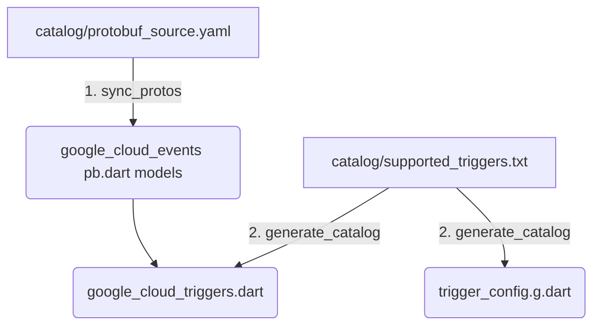

# Maintainer Toolchain (`tool/`)

This directory contains standalone execution scripts that automate our
**Two-Stage Catalog Architecture**.

---

## 🏗️ Execution Sequence

When adding new GCP Eventarc triggers or updating upstream Protobuf definitions,
run these scripts sequentially from the monorepo root:



### Stage 1: Pinned Upstream Protobuf Syncing *(Rare)*
```bash
dart run tool/sync_protos.dart
```
* **Input Manifest:** [catalog/protobuf_source.yaml](../catalog/protobuf_source.yaml)
* **What it does:** Shallow-fetches exact pinned Git commit SHAs of canonical
  Google CloudEvents tarballs into temp storage. Invokes `protoc` to compile
  `.pb.dart` models into `packages/google_cloud_events/lib/google/events/`.
* **When to run:** Only when Google ships breaking `.proto` schema upgrades or
  new target payload definitions.

---

### Stage 2: Routing Catalog Generation *(Frequent)*
```bash
dart run tool/generate_catalog.dart
```
* **Input Manifest:** [catalog/supported_triggers.txt](../catalog/supported_triggers.txt)
* **What it does:** Reads the flat list of supported event strings (e.g.,
  `google.cloud.storage.object.v1.finalized`) and synthesizes both the Shelf
  runtime router enums and CLI generator part files.
* **Network Footprint:** **Zero.** Runs 100% offline.
* **When to run:** Whenever a maintainer appends a new Eventarc trigger string
  to `supported_triggers.txt`.
